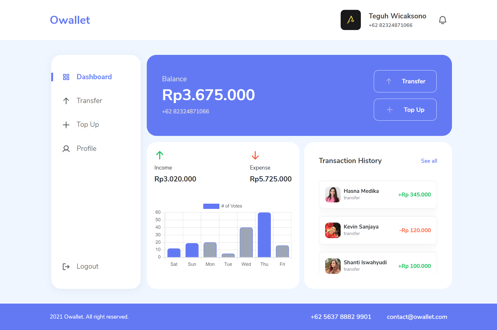

<h1 align='center'>Next App - Owallet </h1>
  <p align="center">
    <a href="https://owallet.vercel.app/">View Demo</a>
    ·
    <a href="https://github.com/twicks95/owallet-next-app/issues">Report Bug</a>
    ·
    <a href="https://github.com/twicks95/owallet-next-app/pulls">Request Feature</a>
  </p>



## About The Project

We live in an age of advanced technology and a modern lifestyle nowadays.

## Built With

[](https://github.com/facebook/react)
[](https://github.com/twbs/bootstrap)
[](https://github.com/react-bootstrap/react-bootstrap)

## Requirements

1. <a href="https://nextjs.org/docs/getting-started">Next Js</a>
2. Node_modules `npm install` or `yarn install`
3. Owallet Backend API [`here`](https://github.com/twicks95/owallet-backend)

## Getting Started

1. Download this Project or you can type `git clone https://github.com/twicks95/owallet-next-app.git`
2. Open the app's directory in CMD or Terminal
3. Type `npm install` or `yarn install`
4. Add next.config.js file at root folder project

```sh
APP_NAME: Owallet 
API_BASE_URL: [Backend URL]
API_IMG_URL: [Backend image URL]
```

5. Type `npm run dev`

## Acknowledgements

- [Axios](https://www.npmjs.com/package/axios)
- [React](https://reactjs.org/)
- [React Bootstrap](https://react-bootstrap.github.io/)
- [Moment](https://www.npmjs.com/package/moment)
- [Next](https://www.npmjs.com/package/next)
- [Phosphor-React](https://www.npmjs.com/package/phosphor-react)
- [Redux](https://github.com/reduxjs/react-redux)
- [React Chart JS](https://github.com/reactchartjs/react-chartjs-2)

## License

© [Teguh Wicaksono](https://github.com/twicks95)
